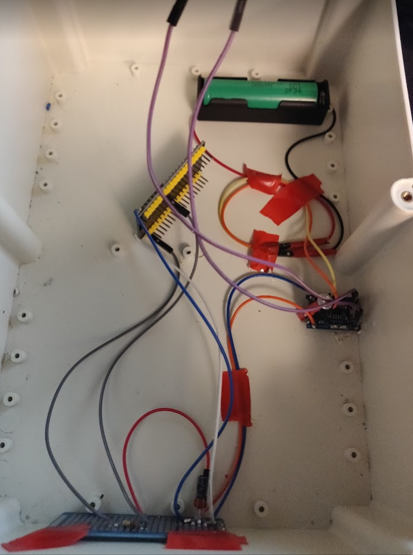

# Water Level  - Solar Powered - ESP32 base

This project is about a well's water level solar powered.

The main point here is to have an autonomous off grid system due to the outdoor location.

The battery capacity will be monitored and a deep sleep state is used to prevent the full discharge.

I'm using an HC-SR04+ ultrasound system to get the distance between the water and the sensor.


# Macro view

This is a macro view of the project.

Solar panel will be placed on the roof. 

The esp32, some electronics and battery will be placed just under the roof in a box.

The HC-SCR04+ will be placed in the well iteself


# List of materials

** all links are affiliated, feel free to find it by your side if you don't want to use the following links **

- 1 x Solar panel 6V :
- 1 x TP4056 USB-C :
- 1 x Li-On battery 18650 :
- 1 x MCP1700-3302E : 
- 1 x 100nF capacitor :
- 1 x 100µF capacitor :
- 1 x 27k ohm resistor :
- 1 x 100k ohm resistor : 
- 1 x ESP32 Wroom : 
- 1 x HC-SR04+ ("plus" is important to have 3.3V version) : 

Total cost arround : XX $

Add more if you want to have solder plate and ready to use box


# Electrical diagram

Here I'm using the solar panel connected to the TP4056 in the input voltage.

Battery will be connected between battery+ and battery- on the TP4056.

To power the ESP32 I will use a voltage regulator system composed by  MCP1700-3302E + a 100nF capacitor + a 100µF capacitor to have exactly 3.3V output.

Also using a voltage divider to get the voltage of the battery and repot it to GPIO35

The HC-SR04+ will be connected to GPIO25 (for trigger) and GPIO26 (for echo).
 


# Assembly

Here is a view of the first prototype (all in a big electrician box) 

## Inside the box

Not really clean, fixing all with some tape.

The TP4056 is placed in a side of the box and protected with USB-C plastic protection. This let me the possibiltiy to charge the battery from outside the box without having to open it.



## Antenna 

You may need to extend the range of the ESP32. 

By default the range is already not so good, but inside a box and from a long distance of the Wifi access point... It can be complicated.

To prevent this I have added an external antenna 

You can solder it directy by scratching a bit the integrated antenna like this : 


And solder the antenna like this + using some glue to keep it in place : 


## Outside the box

This first version is assembled like this.

We have a long cable to join the HC-SR04+.


# ESPhome code

```yaml

# Define the name of the ESP
esphome:
  name: water-level
  friendly_name: water-level

# Define the boot priority and script to execute at startup
  on_boot: 
    priority: -100
    then:
      - script.execute: deep_sleep_evaluation


# Define the kind of board
esp32:
  board: esp32dev
  framework:
    type: arduino

# Enable logging
logger:

# Enable Home Assistant API
api:
  encryption:
    key: "yourpassword-generated-esphome"

ota:
  password: "yourpassword-generated-esphome"

wifi:
  ssid: !secret wifi_ssid
  password: !secret wifi_password

  # Enable fallback hotspot (captive portal) in case wifi connection fails
  ap:
    ssid: "water-level Fallback Hotspot"
    password: "yourpassword-generated-esphome"

captive_portal:


deep_sleep:
  id: deep_sleep_enabled
  # run_duration: 10min
  sleep_duration: 30min


binary_sensor:
  - platform: status
    name: "Water-Level Status"
  
  - platform : homeassistant
    id: disable_deep_sleep
    entity_id: input_boolean.disable_deep_sleep


script: 
  - id: deep_sleep_evaluation
    mode: queued
    then:
      - delay: 10min
      - if:
          condition:
            binary_sensor.is_on: disable_deep_sleep
          then:
            - logger.log: 'Deep Sleep Disabled'
          else:
            - deep_sleep.enter: deep_sleep_enabled
      - script.execute: deep_sleep_evaluation


sensor:
  - platform: ultrasonic
    trigger_pin: 25
    echo_pin: 26
    name: "puit hauteur"
    id: measured_distance
    accuracy_decimals: 4
    update_interval: 30s

  - platform: uptime
    name: "Water-Level Uptime"  
    update_interval: 60s

  - platform: wifi_signal
    name: "Water-Level WiFi Signal"
    update_interval: 120s

  - platform: adc
    pin: GPIO35
    id : "ADCV"
    name: "Water-Level Battery V"
    update_interval: 60s
    attenuation: 11db
    filters:
      - multiply: 1.292
  
  - platform: template
    name: "Water-Level Battery %"
    unit_of_measurement: '%'
    update_interval: 60s
    lambda: |-
      return ((id(ADCV).state -3.30) /0.82 * 100.00);

switch:
  - platform: restart
    name: "Water-Level Restart"


```

# PCB creation

JLCPcb

# Case creation 

** soon **
